###Flink网络传输的数据流向
Flink网络传输的数据流向如下图所示。

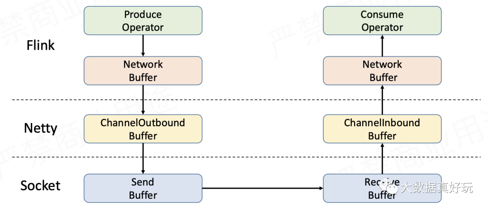

Sender在发送数据时，首先写入TaskManager内部的网络缓存，利用Netty进行传输--将代发送的数据存入Netty的ChannelOutboundBuffer，再经由Socket的发送缓存发送出去。Receiver在接收数据时是反过来的，同样要经过3层缓存，即Socket接收缓存->Netty ChannelInboundBuffer->TaskManager网络缓存。要实现流量控制，就是在上面的流程上做文章。
###Flink的反压传播
反压(back presssure)就是流式系统中关于处理能力的动态反馈机制，并且是从下游到上游的反馈。下图示出数据流在Flink TaskManager之间的流动的逻辑。

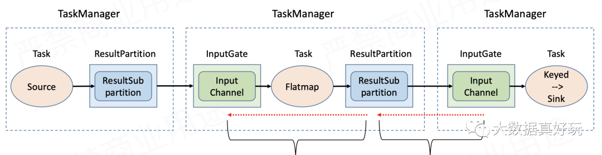

可见，一旦因为下游处理能力不足而出现反压，反压信号的传播应该分为两个阶段：一是从下游TaskManager的输入端(InputGate)传播到直接上游TaskManager的输出端(ResultPartition);二是在TaskManager内部从输出端传播到输入端。当然，我们要重点考虑的是跨TaskManager的反压传播，因为它的链路比较长(参考上一节的数据流向图)，更有可能成为瓶颈。

###下面先来介绍旧版本中的流控和反压机制。

Flink1.5之前：基于TCP的流控和反压在1.5之前，Flink并没有特别的去实现自己的流控机制，而是在传输层直接依靠TCP协议自身具备的滑动窗口机制。下面通过实例来复习TCP滑动窗口是如何实现流控的。

1. 初始情况如下图所示。Sender每单位时间发送3个包，发送窗口初始大小为3；Receiver每单位时间接收1个包，接收窗口初始大小为5(与缓存的大小相同)
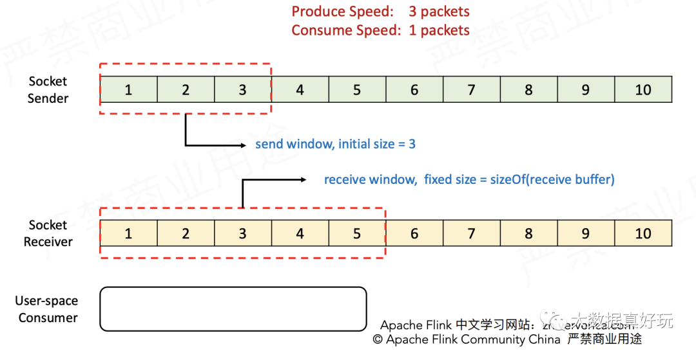
2. Sender发送1~3三个包，Receiver接收到之后将它们放入缓存。
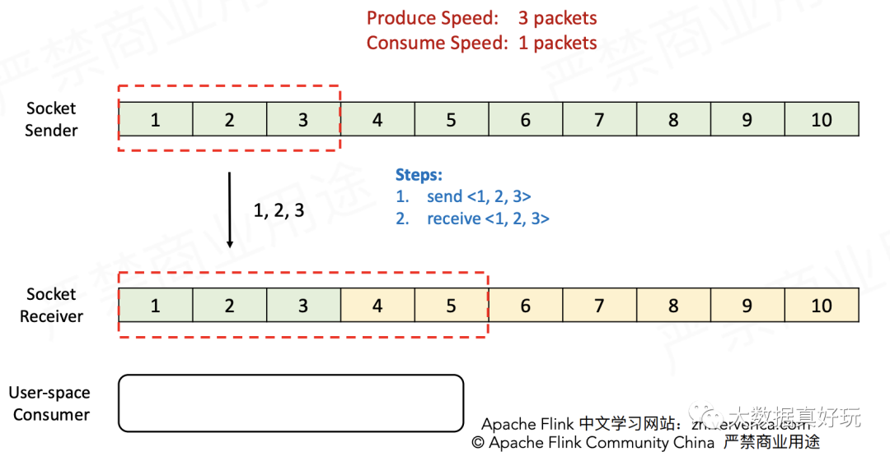
3. Receiver消费一个包，接收窗口向前滑动一格，并告知Sendder ACK=4(表示可以从第4个包开始发送)，以及Window=3(表示接收窗口当前的空余量为3)。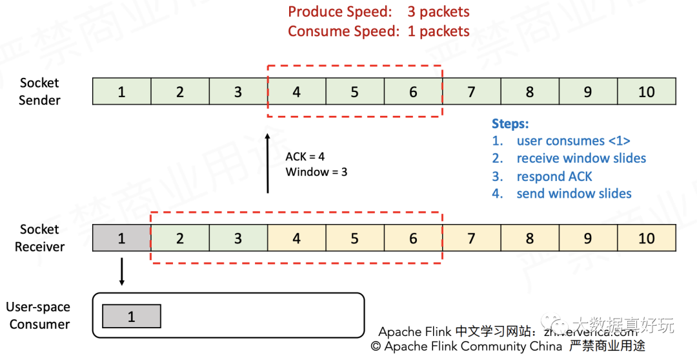
4. Sender接收到ACK消息后发送4~6三个包，Receiver接收到之后将它们放入缓存。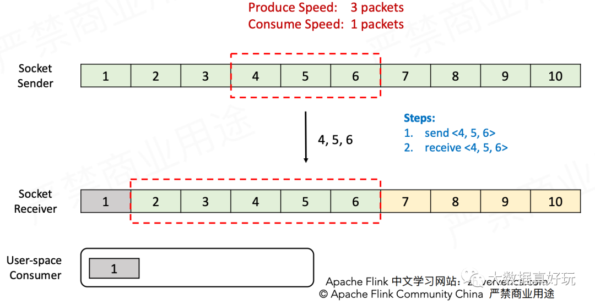
5. Receiver消费一个包，接收窗口就向前滑动一格，并告知Sender ACK=7(表示可以从第7个包开始发送)，以及Window=1(表示接收窗口当前的空余量为1)。Sender接收到ACK消息之后，发现Receiver只能再接收1个包了，就将发送窗口的大小调整为1并发送包7，达到了限流的目的。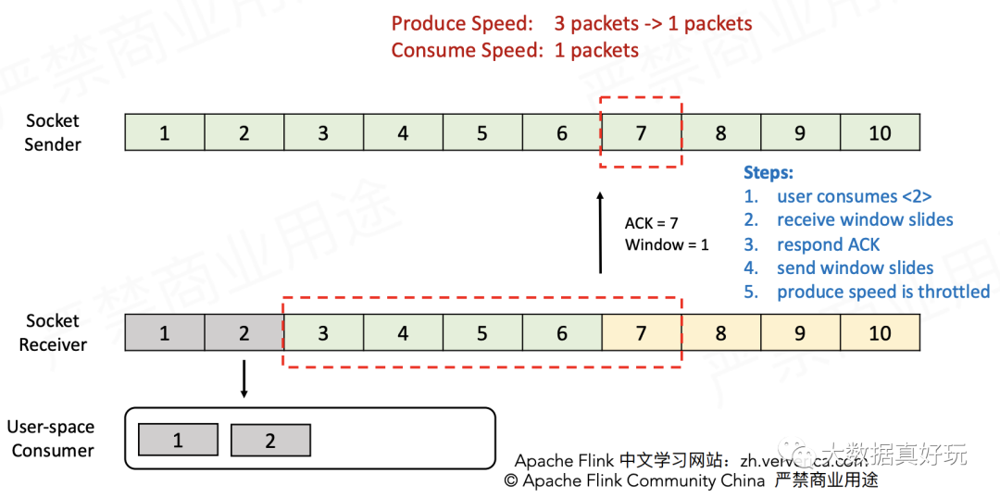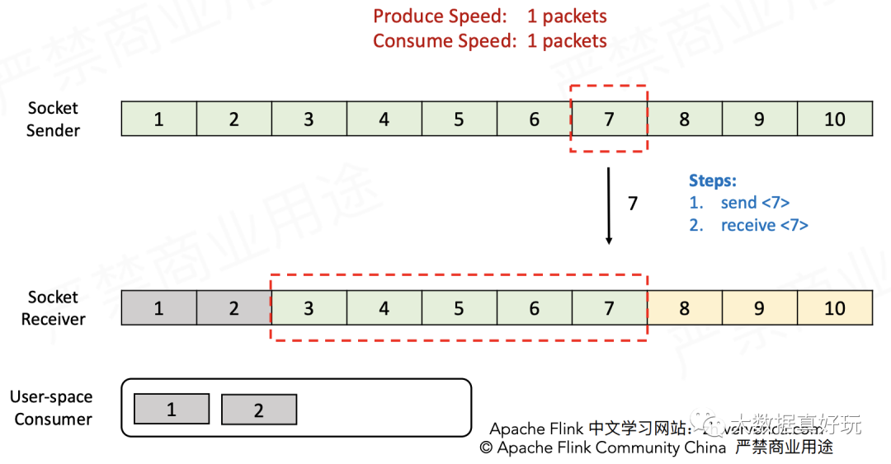
接着这个流程分析下去，可以得知Sender最终会无法发送数据(因为Receiver报告Window=0)，直到Receiver消费掉缓存中的数据才能继续发送。同时Sender还会定时向Receiver发送ZeroWindowProbe探测消息，保证Receiver能够及时将消费能力报告给Sender。

接下来用实例介绍反压流程。
1. 如图所示，Sender发送速度与Receiver接收速度的比是2:1，起初是可以正常发送与接收的。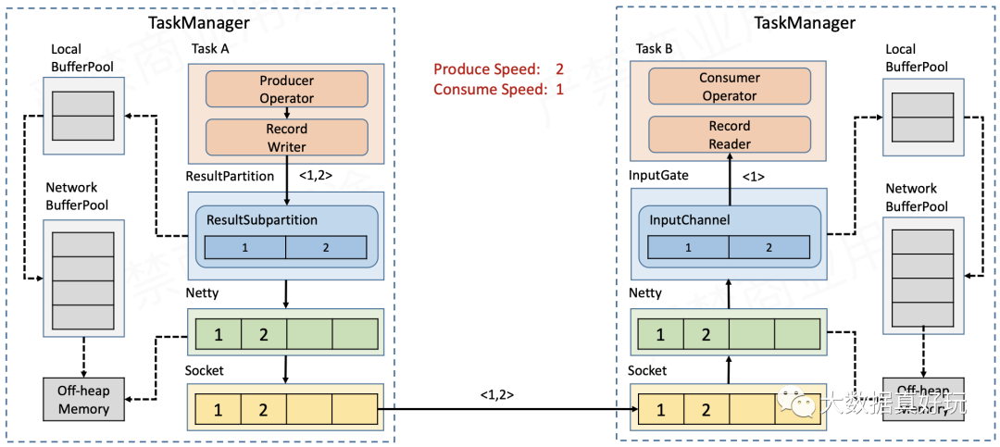
2. 一段时间过后，Receiver端InputChannel本身的缓存被耗尽，因此会向本地缓存池LocalBufferPool申请新的缓存。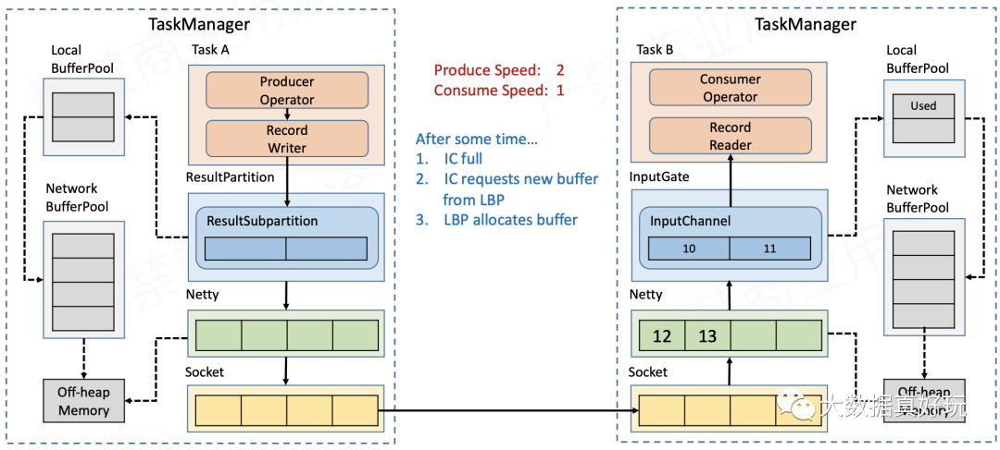
3. 一段时间过后，LocalBufferPool的可用额度会被耗尽，因此会向网络缓存池NetworkBufferPool申请新的缓存。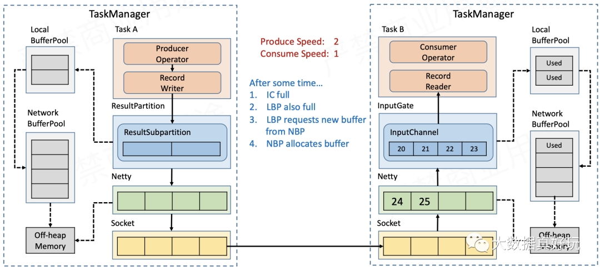
4. 随着数据不断积压，NetworkBufferPool的额度也会被耗尽，此时没有空间再接收新的数据，Netty的auto read会被关闭，不再从Socket缓存读取数据。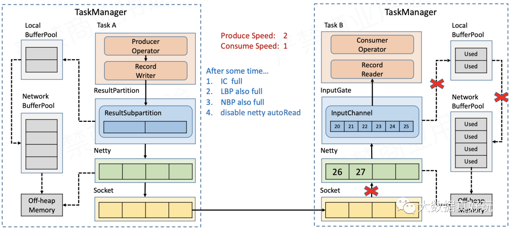
5. Socket缓存耗尽后，Receiver报告Window=0(参加上文的滑动窗口)，Sender的Socket就会停止发送数据。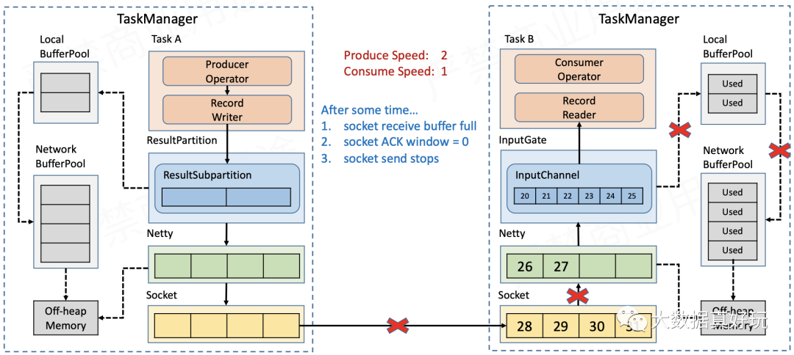
6. Sender端的Socket缓存积压，导致Netty无法再发送数据。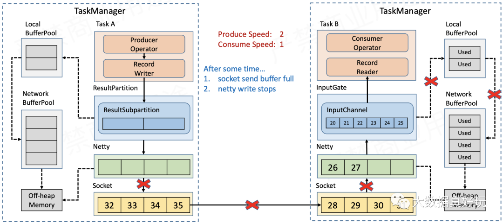
7. 待发送的数据都积压在Sender的ChannelOutboundBuffer中，当数据量超过Netty的highwatermark之后，Channel被置为不可写，ResultSubPartition也就不再向Netty写数据。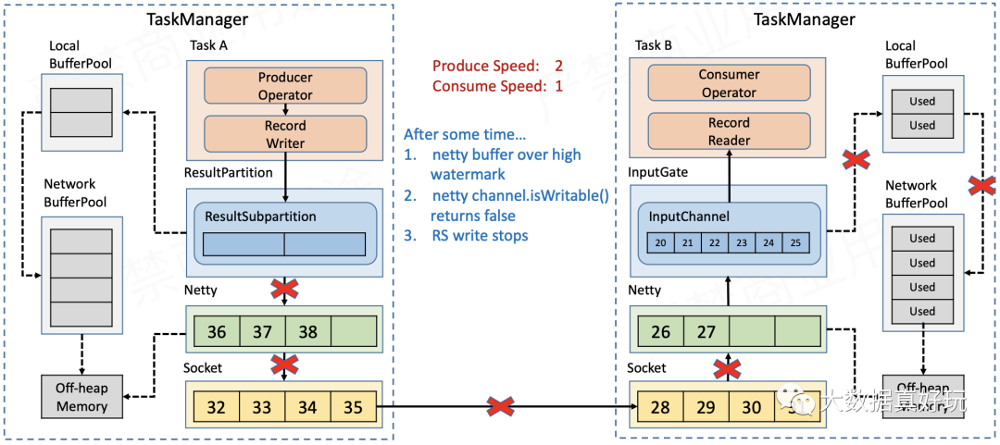
8. Sender端的ResultSubPartition缓存满了之后，就会向Receiver端的InputChannel一样，不断的向LocalBufferPool和NetworkBufferPool申请新的缓存，直到缓存全部耗尽，RecordWriter不能再写数据。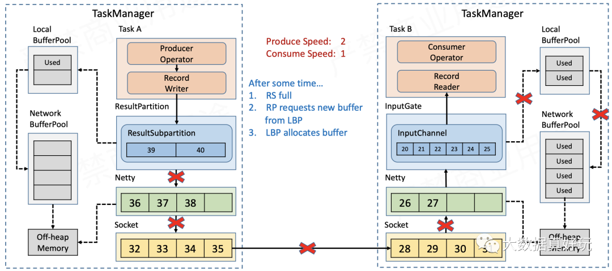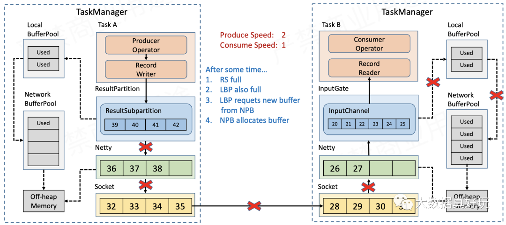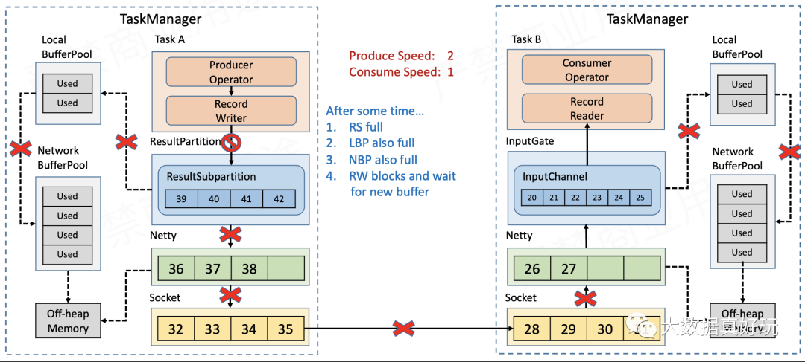
这样，我们就实现了反压向上游TaskManager的传递。
###Flink1.5之后：基于Credit的流控和反压
基于TCP的流控和反压方案有两大缺点：
- 只要TaskManager执行的一个Task触发反压，该TaskManager与上游TaskManager的Socket就不能再传输数据，从而影响到所有其它正常的Task，以及Checkpoint Barrier的流动，可能造成作业雪崩。
- 反压的传播链路太长，切需要耗尽所有网络缓存之后才能有效触发，延迟比较大。

Flink1.5+版本为了解决这两个问题，引入了基于Credit的流控和反压机制。它本质是将TCP的流控机制从传输层提升到了应用层--即ResultPartition和InputGate的层级，从而避免在传输层造成阻塞。具体来讲：
- Sender端的ResultSubPartition会统计累计的消息量(以缓存个数计)，以backlog size的形式通知到Receiver端的InputGate；
- Receiver端InputGate会计算有多少空间能够接收消息(同样以缓存个数计)，以credit的形式通知到Sender端的ResultSubPartition。

也就是说，Sender和Receiver通过互相告知对方自己的处理能力的方式来精准的进行流控(注意backlog size和credit也是要通过传输层的，不是直接交换的)，接下来仍然通过实例来说明基于Credit的流控和反压流程。
1. 仍然是Sender发送速度与Receiver接收速度的比是2:1的情景。Sender端的ResultSubPartition积压了2个缓存的数据，因此会将该批次要发送的数据与backlog size=2一同发往Receiver。Receiver收到当前批数据和backlog size之后，会计算InputChannel是否有足够的缓存来接收下一批数据，如果不够，则会去LocalBufferPool/NetworkBufferPool申请缓存，并将credit=3通知到上游的ResultSubPartition，表示自己能够接收3个缓存的消息。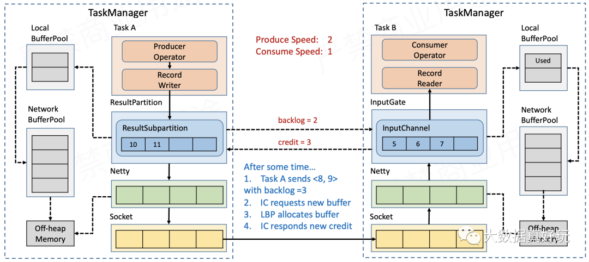
2. 随着Receiver端的数据不断积压，网络缓存最终被耗尽，因此会反馈给上游credit=0(相当于TCP滑动窗口的window=0)，Sender端ResultPartition到Netty的链路会被阻断。按照上一节所述流程，Sender端的网络缓存会被更快的耗尽，RecordWriter不能再写数据，从而达到反压的效果。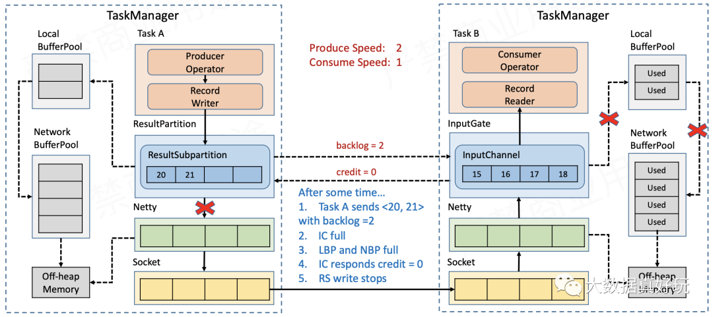

由上可知，反压信号在TaskManager之间不需要再通过传输层随着数据向上反馈，大大降低了反压的延迟。并且也不会因为一个Task反压而阻塞整个Socket链路，能够相当精确的在Task粒度控制流量，不仅轻量级，而且高效。

