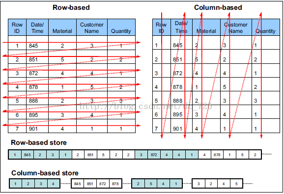
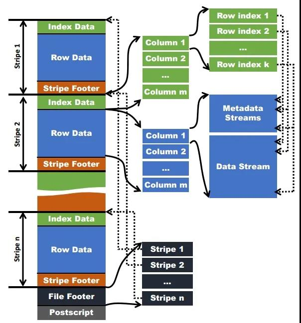
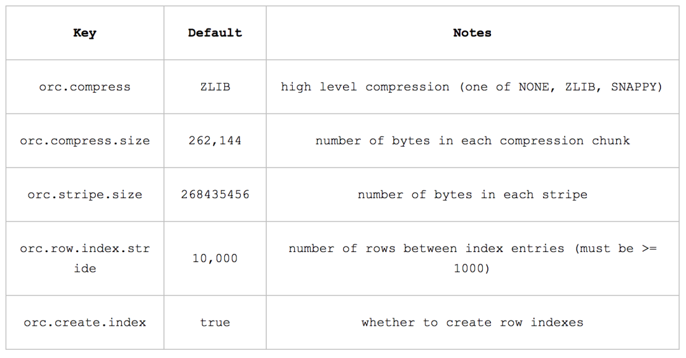

###一、ORC File文件结构
ORC的全称是(Optimized Row Columnar)，ORC文件格式是一种Hadoop生态圈中的列式存储格式，它的产生早在2013年初，最初产生自Apache Hive，用于降低Hadoop数据存储空间和加速Hive查询速度。和Parquet类似，它并不是一个单纯的列式存储格式，仍然是首先根据行组分割整个表，在每一个行组内进行按列存储。ORC文件是自描述的，它的元数据使用Protocol Buffers序列化，并且文件中的数据尽可能的压缩以降低存储空间的消耗，目前也被Spark SQL、Presto等查询引擎支持，但是Impala对于ORC目前没有支持，仍然使用Parquet作为主要的列式存储格式。2015年ORC项目被Apache项目基金会提升为Apache顶级项目。ORC具有以下一些优势:

- 1: ORC是列式存储，有多种文件压缩方式，并且有着很高的压缩比。
- 2：文件是可切分（Split）的。因此，在Hive中使用ORC作为表的文件存储格式，不仅节省HDFS存储资源，查询任务的输入数据量减少，使用的MapTask也就减少了。
- 3：提供了多种索引，row group index、bloom filter index。
- 4：ORC可以支持复杂的数据结构（比如Map等）

####列式存储　　
由于OLAP查询的特点，列式存储可以提升其查询性能，但是它是如何做到的呢？这就要从列式存储的原理说起，从图1中可以看到，相对于关系数据库中通常使用的行式存储，在使用列式存储时每一列的所有元素都是顺序存储的。由此特点可以给查询带来如下的优化：

- 查询的时候不需要扫描全部的数据，而只需要读取每次查询涉及的列，这样可以将I/O消耗降低N倍，另外可以保存每一列的统计信息(min、max、sum等)，实现部分的谓词下推。
- 由于每一列的成员都是同构的，可以针对不同的数据类型使用更高效的数据压缩算法，进一步减小I/O。
- 由于每一列的成员的同构性，可以使用更加适合CPU pipeline的编码方式，减小CPU的缓存失效。



关于Orc文件格式的官网介绍，见：https://cwiki.apache.org/confluence/display/Hive/LanguageManual+ORC  
需要注意的是，ORC在读写时候需要消耗额外的CPU资源来压缩和解压缩，当然这部分的CPU消耗是非常少的。

####数据模型

和Parquet不同，ORC原生是不支持嵌套数据格式的，而是通过对复杂数据类型特殊处理的方式实现嵌套格式的支持，例如对于如下的hive表：

```CREATE TABLE `orcStructTable`(
  `name` string,
  `course` struct<course:string,score:int>,
  `score` map<string,int>,
  `work_locations` array<string>
)```

在ORC的结构中包含了复杂类型列和原始类型，前者包括LIST、STRUCT、MAP和UNION类型，后者包括BOOLEAN、整数、浮点数、字符串类型等，其中STRUCT的孩子节点包括它的成员变量，可能有多个孩子节点，MAP有两个孩子节点，分别为key和value，LIST包含一个孩子节点，类型为该LIST的成员类型，UNION一般不怎么用得到。每一个Schema树的根节点为一个Struct类型，所有的column按照树的中序遍历顺序编号。

ORC只需要存储schema树中叶子节点的值，而中间的非叶子节点只是做一层代理，它们只需要负责孩子节点值得读取，只有真正的叶子节点才会读取数据，然后交由父节点封装成对应的数据结构返回。

####文件结构

和Parquet类似，ORC文件也是以二进制方式存储的，所以是不可以直接读取，ORC文件也是自解析的，它包含许多的元数据，这些元数据都是同构ProtoBuffer进行序列化的。ORC的文件结构如下图，其中涉及到如下的概念：

- ORC文件：保存在文件系统上的普通二进制文件，一个ORC文件中可以包含多个stripe，每一个stripe包含多条记录，这些记录按照列进行独立存储，对应到Parquet中的row group的概念。
- 文件级元数据：包括文件的描述信息PostScript、文件meta信息（包括整个文件的统计信息）、所有stripe的信息和文件schema信息。
- stripe：一组行形成一个stripe，每次读取文件是以行组为单位的，一般为HDFS的块大小，保存了每一列的索引和数据。
- stripe元数据：保存stripe的位置、每一个列的在该stripe的统计信息以及所有的stream类型和位置。
- row group：索引的最小单位，一个stripe中包含多个row group，默认为10000个值组成。
- stream：一个stream表示文件中一段有效的数据，包括索引和数据两类。索引stream保存每一个row group的位置和统计信息，数据stream包括多种类型的数据，具体需要哪几种是由该列类型和编码方式决定。



在ORC文件中保存了三个层级的统计信息，分别为文件级别、stripe级别和row group级别的，他们都可以用来根据Search ARGuments（谓词下推条件）判断是否可以跳过某些数据，在统计信息中都包含成员数和是否有null值，并且对于不同类型的数据设置一些特定的统计信息。

- (1) file level
在ORC文件的末尾会记录文件级别的统计信息，会记录整个文件中columns的统计信息。这些信息主要用于查询的优化，也可以为一些简单的聚合查询比如max, min, sum输出结果。 
- (2) stripe level
ORC文件会保存每个字段stripe级别的统计信息，ORC reader使用这些统计信息来确定对于一个查询语句来说，需要读入哪些stripe中的记录。比如说某个stripe的字段max(a)=10，min(a)=3，那么当where条件为a >10或者a <3时，那么这个stripe中的所有记录在查询语句执行时不会被读入。 
- (3) row level 
为了进一步的避免读入不必要的数据，在逻辑上将一个column的index以一个给定的值(默认为10000，可由参数配置)分割为多个index组。以10000条记录为一个组，对数据进行统计。Hive查询引擎会将where条件中的约束传递给ORC reader，这些reader根据组级别的统计信息，过滤掉不必要的数据。如果该值设置的太小，就会保存更多的统计信息，用户需要根据自己数据的特点权衡一个合理的值。

####数据访问

读取ORC文件是从尾部开始的，第一次读取16KB的大小，尽可能的将Postscript和Footer数据都读入内存。文件的最后一个字节保存着PostScript的长度，它的长度不会超过256字节，PostScript中保存着整个文件的元数据信息，它包括文件的压缩格式、文件内部每一个压缩块的最大长度(每次分配内存的大小)、Footer长度，以及一些版本信息。在Postscript和Footer之间存储着整个文件的统计信息(上图中未画出)，这部分的统计信息包括每一个stripe中每一列的信息，主要统计成员数、最大值、最小值、是否有空值等。

接下来读取文件的Footer信息，它包含了每一个stripe的长度和偏移量，该文件的schema信息(将schema树按照schema中的编号保存在数组中)、整个文件的统计信息以及每一个row group的行数。

处理stripe时首先从Footer中获取每一个stripe的其实位置和长度、每一个stripe的Footer数据(元数据，记录了index和data的的长度)，整个striper被分为index和data两部分，stripe内部是按照row group进行分块的(每一个row group中多少条记录在文件的Footer中存储)，row group内部按列存储。每一个row group由多个stream保存数据和索引信息。每一个stream的数据会根据该列的类型使用特定的压缩算法保存。在ORC中存在如下几种stream类型：

- PRESENT：每一个成员值在这个stream中保持一位(bit)用于标示该值是否为NULL，通过它可以只记录部位NULL的值
- DATA：该列的中属于当前stripe的成员值。
- LENGTH：每一个成员的长度，这个是针对string类型的列才有的。
- DICTIONARY_DATA：对string类型数据编码之后字典的内容。
- SECONDARY：存储Decimal、timestamp类型的小数或者纳秒数等。
- ROW_INDEX：保存stripe中每一个row group的统计信息和每一个row group起始位置信息。

在初始化阶段获取全部的元数据之后，可以通过includes数组指定需要读取的列编号，它是一个boolean数组，如果不指定则读取全部的列，还可以通过传递SearchArgument参数指定过滤条件，根据元数据首先读取每一个stripe中的index信息，然后根据index中统计信息以及SearchArgument参数确定需要读取的row group编号，再根据includes数据决定需要从这些row group中读取的列，通过这两层的过滤需要读取的数据只是整个stripe多个小段的区间，然后ORC会尽可能合并多个离散的区间尽可能的减少I/O次数。然后再根据index中保存的下一个row group的位置信息调至该stripe中第一个需要读取的row group中。

ORC文件格式只支持读取指定字段，还不支持只读取特殊字段类型中的指定部分。 

使用ORC文件格式时，用户可以使用HDFS的每一个block存储ORC文件的一个stripe。对于一个ORC文件来说，stripe的大小一般需要设置得比HDFS的block小，如果不这样的话，一个stripe就会分别在HDFS的多个block上，当读取这种数据时就会发生远程读数据的行为。如果设置stripe的只保存在一个block上的话，如果当前block上的剩余空间不足以存储下一个strpie，ORC的writer接下来会将数据打散保存在block剩余的空间上，直到这个block存满为止。这样，下一个stripe又会从下一个block开始存储。

由于ORC中使用了更加精确的索引信息，使得在读取数据时可以指定从任意一行开始读取，更细粒度的统计信息使得读取ORC文件跳过整个row group，ORC默认会对任何一块数据和索引信息使用ZLIB压缩，因此ORC文件占用的存储空间也更小，这点在后面的测试对比中也有所印证。

####文件压缩

ORC文件使用两级压缩机制，首先将一个数据流使用流式编码器进行编码，然后使用一个可选的压缩器对数据流进行进一步压缩。 
一个column可能保存在一个或多个数据流中，可以将数据流划分为以下四种类型： 
- Byte Stream 
字节流保存一系列的字节数据，不对数据进行编码。 
- Run Length Byte Stream 
字节长度字节流保存一系列的字节数据，对于相同的字节，保存这个重复值以及该值在字节流中出现的位置。 
- Integer Stream 
整形数据流保存一系列整形数据。可以对数据量进行字节长度编码以及delta编码。具体使用哪种编码方式需要根据整形流中的子序列模式来确定。 
- Bit Field Stream 
比特流主要用来保存boolean值组成的序列，一个字节代表一个boolean值，在比特流的底层是用Run Length Byte Stream来实现的。 

接下来会以Integer和String类型的字段举例来说明。 

- (1) Integer 
对于一个整形字段，会同时使用一个比特流和整形流。比特流用于标识某个值是否为null，整形流用于保存该整形字段非空记录的整数值。 

- (2) String 
对于一个String类型字段，ORC writer在开始时会检查该字段值中不同的内容数占非空记录总数的百分比不超过0.8的话，就使用字典编码，字段值会保存在一个比特流，一个字节流及两个整形流中。比特流也是用于标识null值的，字节流用于存储字典值，一个整形流用于存储字典中每个词条的长度，另一个整形流用于记录字段值。 

如果不能用字典编码，ORC writer会知道这个字段的重复值太少，用字典编码效率不高，ORC writer会使用一个字节流保存String字段的值，然后用一个整形流来保存每个字段的字节长度。 

在ORC文件中，在各种数据流的底层，用户可以自选ZLIB, Snappy和LZO压缩方式对数据流进行压缩。编码器一般会将一个数据流压缩成一个个小的压缩单元，在目前的实现中，压缩单元的默认大小是256KB。

###二、Hive+ORC建立数据仓库
在建Hive表的时候我们就应该指定文件的存储格式。所以你可以在Hive QL语句里面指定用ORCFile这种文件格式，如下：

```
CREATE TABLE ... STORED AS ORC
    
   ALTER TABLE ... [PARTITION partition_spec] SET FILEFORMAT ORC
    
   SET hive.default.fileformat=Orc
```

所有关于ORCFile的参数都是在Hive SQL语句的TBLPROPERTIES字段里面出现，他们是：



###三、Java操作ORC
到https://orc.apache.org官网下载orc源码包，然后编译获取orc-core-1.3.0.jar、orc-mapreduce-1.3.0.jar、orc-tools-1.3.0.jar，将其加入项目中

```
import org.apache.hadoop.conf.Configuration;
import org.apache.hadoop.fs.Path;
import org.apache.hadoop.hive.ql.exec.vector.LongColumnVector;
import org.apache.hadoop.hive.ql.exec.vector.VectorizedRowBatch;
import org.apache.orc.CompressionKind;
import org.apache.orc.OrcFile;
import org.apache.orc.TypeDescription;
import org.apache.orc.Writer;

public class TestORCWriter {
    public static void main(String[] args) throws Exception {
        Path testFilePath = new Path("/tmp/test.orc");
        Configuration conf = new Configuration();
        TypeDescription schema = TypeDescription.fromString("struct<field1:int,field2:int,field3:int>");
        Writer writer = OrcFile.createWriter(testFilePath, OrcFile.writerOptions(conf).setSchema(schema).compress(CompressionKind.SNAPPY));
        VectorizedRowBatch batch = schema.createRowBatch();
        LongColumnVector first = (LongColumnVector) batch.cols[0];
        LongColumnVector second = (LongColumnVector) batch.cols[1];
        LongColumnVector third = (LongColumnVector) batch.cols[2];

        final int BATCH_SIZE = batch.getMaxSize();
        // add 1500 rows to file
        for (int r = 0; r < 15000000; ++r) {
            int row = batch.size++;
            first.vector[row] = r;
            second.vector[row] = r * 3;
            third.vector[row] = r * 6;
            if (row == BATCH_SIZE - 1) {
                writer.addRowBatch(batch);
                batch.reset();
            }
        }
        if (batch.size != 0) {
            writer.addRowBatch(batch);
            batch.reset();
        }
        writer.close();
    }
}
```

大多情况下，还是建议在Hive中将文本文件转成ORC格式，这种用JAVA在本地生成ORC文件，属于特殊需求场景。