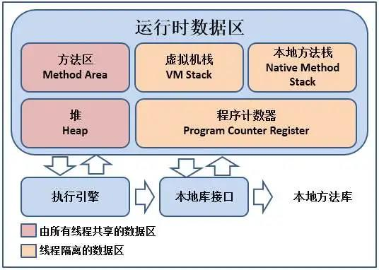

Java虚拟机规范规定JVM的内存分为了好几块，比如堆，栈，程序计数器，方法区等，而Hotspot jvm的实现中，将内存分为了三部分，新生代，老年代，持久代，其中持久代实现了规范中规定的方法区，而内存模型中不同的部分都会出现相应的OOM错误，接下来我们就分开讨论一下。
###栈溢出(StackOverflowError)
栈溢出抛出java.lang.StackOverflowError错误，出现此种情况是因为方法运行的时候栈的深度超过了虚拟机容许的最大深度所致。

出现这种情况，一般情况下是程序错误所致的，比如写了一个死递归，就有可能造成此种情况。下面我们通过一段代码来模拟一下此种情况的内存溢出
```
public class OOMTest{

  public void stackOverFlowMethod(){
      stackOverFlowMethod();
  }

  public static void main(String... args){
      OOMTest oom = new OOMTest();
      oom.stackOverFlowMethod();
  }
}
```
运行上面的代码，会抛出如下的异常：
```
Exception in thread "main" java.lang.StackOverflowError
        at OOMTest.stackOverFlowMethod(OOMTest.java:6)
```
###堆溢出(OutOfMemoryError:java heap space)
堆内存溢出的时候，虚拟机会抛出java.lang.OutOfMemoryError:java heap space，出现此种情况的时候，我们需要根据内存溢出的时候产生的dump文件来具体分析(需要增加-XX:+HeapDumpOnOutOfMemoryError jvm启动参数)。出现此种问题的时候有可能是内存泄漏，也有可能是内存溢出了。

如果内存泄漏，我们要找出泄漏的对象是怎么被GC ROOT引用起来，然后通过引用链具体分析泄漏的原因。

如果出现了内存溢出问题，这往往是程序本身需要的内存大于了我们给虚拟机配置的内存，这种情况下，我们可以采用调大-Xmx来解决这种问题。

下面我们通过如下的代码来演示一下此种情况的溢出：
```
import java.util.*;
import java.lang.*;
public class OOMTest{

        public static void main(String... args){
                List<byte[]> buffer = new ArrayList<byte[]>();
                buffer.add(new byte[10*1024*1024]);
        }

}
```
我们通过如下的命令运行上面的代码：
```
java -verbose:gc -Xmn10M -Xms20M -Xmx20M -XX:+PrintGC OOMTest
```
程序输出如下的信息：
```
[GC 1180K->366K(19456K), 0.0037311 secs]
[Full GC 366K->330K(19456K), 0.0098740 secs]
[Full GC 330K->292K(19456K), 0.0090244 secs]
Exception in thread "main" java.lang.OutOfMemoryError: Java heap space
        at OOMTest.main(OOMTest.java:7)
```
从运行结果可以看出，JVM进行了一次Minor gc和两次的Major hc，从Major gc的输出可以看出，gc以后old区使用率为134k，而字节数组为10M，加起来大于了old generation的空间，所以抛出了异常，如果调整-Xms21M,-Xmx21m，那么就不会触发gc操作也不会出现异常了。

通过上面的实验也从侧面验证了一个结论：当对象大于新生代剩余内存的时候，将直接放入老年代，当老年代剩余内存还是无法放下的时候，触发垃圾收集，收集后还是不能放下就会抛出内存溢出异常了。
###持久代溢出(OutOfMemoryError:PermGen space)

我们知道Hotspot jvm通过持久代实现了java虚拟机规范中的方法区，而运行时的常量池就是保存在方法区中的，因此持久代溢出有可能是运行时常量池溢出，也有可能是方法区中保存的class对象没有被及时回收掉或者class信息占用的内存超过了我们的配置。当持久代溢出的时候抛出java.lang.OutOfMemoryError:PermGen space。在工作中可能在如下几种场景下会出现此问题。

- 使用一些应用服务器的热部署的时候，我们就会遇到热部署几次以后发现内存溢出了，这种情况就是因为每次热部署的后，原来的class没有被卸载掉。
- 如果应用程序本身比较大，涉及的类库毕竟多，但是我们分配给持久代的内存(通过-XX:PermSize和-XX:MaxPermSize来设置)比较小的时候也可能出现这种问题。
- 一些第三方框架，比如spring，hibernate都通过字节码生成技术(比如CGLib)来实现一些增强的功能，这种情况可能需要更大的方法区来存储动态生成的Class文件。

我们知道Java中字符床常量是放在常量池中的，String.intern()这个方法运行的时候，会检查常量池中是否存在和本字符串相等的对象，如果存在直接返回常量池中对象的引用，不不存在的话，先把次字符串加入常量池，然后再返回字符串的引用。那么我们就可以通过String.intern方法来模拟一下运行时常量区的溢出。下面我们通过如下的代码来模拟此种情况：
```
import java.util.*;
import java.lang.*;
public class OOMTest{

        public static void main(String... args){
                List<String> list = new ArrayList<String>();
                while(true){
                        list.add(UUID.randomUUID().toString().intern());
                }
        }

}
```
我们通过如下的命令运行上面代码：
```
java -verbose:gc -Xmn5M -Xms10M -Xmx10M -XX:MaxPermSize=1M -XX:+PrintGC OOMTest
```
运行后的输出如下图所示：
```
Exception in thread "main" java.lang.OutOfMemoryError: PermGen space
           at java.lang.String.intern(Native Method)
           at OOMTest.main(OOMTest.java:8)
```
通过上面的代码，我们成功模拟了运行时常量池溢出的情况，从输出中的PermGen space可以看出确实是持久代发生了溢出，这也验证了，我们前面说的Hotspot jvm通过持久代来实现方法区的说法。
###OutOfMemoryError:unable to create native thread
最后我们再来看看java.lang.OutOfMemoryError:unable to create native thread这种错误。出现这种情况的时候，一般是下面两种情况导致的：
1. 程序创建的线程数超过了操作系统的限制。对于Linux系统，我们可以通过ulimit -u来查看此限制
2. 给虚拟机分配的内存过大，导致创建线程的时候需要的native内存太少。我们都知道操作系统对每个进程的内存是有限制的，我们启动jvm，相当于启动了一个进程，假如我们一个进程占用了4G的内存，那么通过下面的公式计算出来的剩余内存就是建立线程栈的时候可以用的内存。线程栈总可用内存=4G-(-Xmx的值)-(-XX:MaxPermSize的值)-程序计数器占用的内存。通过上面的公式我们可以看出，-Xmx和MaxPermSize的值越大，那么留给线程栈可用的空间就越小，在-Xss参数配置的栈容量不变的情况下，可以创建的线程数就越小。因此如果是因为这种情况导致的unable to create native thread，那么我们增大进程所占用的总内存，或者减少-Xmx或者-Xss来达到创建更多线程的目的。